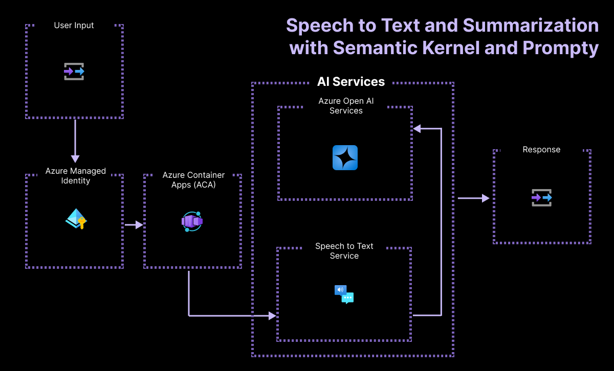

# Automated Ticket Processing using Azure AI

[](https://github.com/codespaces/new?hide_repo_select=true&ref=main&repo=787124470&machine=standardLinux32gb&devcontainer_path=.devcontainer%2Fdevcontainer.json&location=WestUs2)
[](https://vscode.dev/redirect?url=vscode://ms-vscode-remote.remote-containers/cloneInVolume?url=https://github.com/azure-samples/summarization-openai-csharp-prompty)

This sample creates a web-based app that allows workers at a company called Contoso Manufacturing to report issues via text or speech. Audio input is translated to text and then summarized to hightlight important information and specifiy the department the report should be sent to. It uses the **[Azure AI Speech Service](https://learn.microsoft.com/en-us/azure/ai-services/speech-service/)** to translate the user's speech into text. It leverages **Azure OpenAI** to summarize the text and **[Semantic Kernel](https://learn.microsoft.com/en-us/semantic-kernel/overview/?tabs=Csharp)** with **Prompty files** to manage and insert the prompt into our code, and to evaluate prompt/LLM performance.

---

## Table of Contents

1. [Features](#features)
    * [Architecture Diagram](#architecture-diagram)
1. [Getting Started](#getting-started)
    * [GitHub Codespaces](#github-codespaces)
    * [VS Code Dev Containers](#vs-code-dev-containers)
    * [Local Environment](#local-environment)
1. [Deployment](#deployment)
1. [Exploring the Sample](#exploring-the-sample)
1. [Understanding the Source](#understanding-the-source)
1. [Guidance](#guidance)
    * [Region Availability](#region-availability)
    * [Costs](#costs)
    * [Security](#security)
    * [Troubleshooting](#troubleshooting)
    * [Cleaning up](#cleaning-up)
    * [Resources](#resources)

## Features

This project template provides the following features:

* [Azure OpenAI](https://learn.microsoft.com/en-us/azure/ai-services/openai/) to summarize the text.
* [Azure AI Speech Service](https://learn.microsoft.com/en-us/azure/ai-services/speech-service/) to translate the users speech into text.
* [Semantic Kernel](https://learn.microsoft.com/en-us/semantic-kernel/overview/?tabs=Csharp) to access AI models, integrate prompts, and evaluate prompt/LLM performance.
* Using Prompty files to define LLM prompts.
* Sample **azd configuration** for deploying required resources in Azure.
* Managed Identity configuration as a best practice for managing sensitive credentials.

### Architecture Diagram



## Getting Started

You have a few options for getting started with this template.

The quickest way to get started is GitHub Codespaces, since it will setup all the tools for you, but you can also [set it up locally](#local-environment).

### GitHub Codespaces

You can run this template virtually by using GitHub Codespaces. The button will open a web-based VS Code instance in your browser:

1. Open the template (this may take several minutes)
    [](https://codespaces.new/Azure-Samples/summarization-openai-csharp-prompty)

2. Open a terminal window.
3. Sign in to your Azure account:

    ```shell
    azd auth login
    ```

4. Provision the resources and deploy the code:

    ```shell
    azd up
    ```

    This project uses gpt-3.5-turbo which may not be available in all Azure regions. Check for [up-to-date region availability](https://learn.microsoft.com/azure/ai-services/openai/concepts/models#standard-deployment-model-availability) and select a region during deployment accordingly.

Once the above steps are completed you can jump straight to [exploring the sample](#exploring-the-sample).

### VS Code Dev Containers

A related option is VS Code Dev Containers, which will open the project in your local VS Code using the [Dev Containers extension](https://marketplace.visualstudio.com/items?itemName=ms-vscode-remote.remote-containers):

1. Start Docker Desktop (install it if not already installed)
2. Open the project:
    [](https://vscode.dev/redirect?url=vscode://ms-vscode-remote.remote-containers/cloneInVolume?url=https://github.com/Azure-Samples/summarization-openai-csharp-prompty.git)
3. In the VS Code window that opens, once the project files show up (this may take several minutes), open a terminal window.

Once you've completed these steps jump to [deployment](#deployment).

### Local Environment

#### Prerequisites

* [.NET SDK](https://dotnet.microsoft.com/en-us/download/dotnet/8.0)
* [Git](https://git-scm.com/downloads)
* [Azure Developer CLI (azd)](https://aka.ms/install-azd)
* [VS Code](https://code.visualstudio.com/Download) or [Visual Studio](https://visualstudio.microsoft.com/downloads/)
  * If using VS Code, install the [C# Dev Kit](https://marketplace.visualstudio.com/items?itemName=ms-dotnettools.csdevkit)

#### Initializing the project

Create a new folder and switch to it in the terminal, then run this command to download the project code:

```shell
    azd init -t summarization-openai-csharp-prompty
```

Note that this command will initialize a git repository, so you do not need to clone this repository.

Once the project is cloned, open it in VS Code and continue on to [deployment](#deployment).

## Deployment

Once you've opened the project in [Dev Containers](#vs-code-dev-containers), or [locally](#local-environment), you can deploy it to Azure.

1. Sign in to your Azure account:

    ```shell
    azd auth login
    ```

    If you have any issues with that command, you may also want to try `azd auth login --use-device-code`.

2. Provision the resources and deploy the code:

    ```shell
    azd up
    ```

    Note: This project uses gpt-3.5-turbo which may not be available in all Azure regions. Check for [up-to-date region availability](https://learn.microsoft.com/azure/ai-services/openai/concepts/models#standard-deployment-model-availability) and when prompted to select a region during deployment, choose one that supports this model.

## Exploring the sample

This sample is made up of three projects, all located within the `src\SummarizationAPI` folder:

* **SummarizationAPI.Console** - a test console application that uses Azure Speech Services to translate speech to text.
* **Summarization.Evaluation.Test** - a unit test project, used for evaluating and testing prompts against Azure OpenAI.
* **SummarizationAPI** - an ASP.NET Core project which creates a `/Summarization` HTTP Endpoint that is used to summarize text using Azure OpenAI.

> Tip: If you're using Visual Studio, open the `src\SummarizationAPI.sln` solution to work with this sample. If you're using VS Code with the C# Dev Kit extension (included in the setup instructions), use the [**Solution Explorer**](https://code.visualstudio.com/docs/csharp/project-management) view.

Each project in this sample can be run independently, to test the full end-to-end of the sample, start with the `SummarizationAPI.Console` project.

### Running the Console project

> Note: At this time it can only be run on a local machine due to limitations with the Speech Services SDK. If you're using the sample in GitHub Codespaces or a Dev Container, you can still test the Summarization API directly or use the test project.

Before running the project, you'll need to setup the configuration settings to reference the resources that were deployed to Azure. To do this, open the ``src\SummarizationAPI\SummarizationAPI.Console\appsettings.json`` file in your project. Copy values from the ``\.azure\<env-name>\.env`` file, generated during Azure resource provisioning, into the settings in appsettings.json using the following table as a guide.

| .env variable                | appsettings.json value |
|------------------------------|--------------------------------------------|
| AZURE_SPEECH_REGION          | ``AzureSpeech -> Region``|
| AZURE_SPEECH_RESOURCE_ID     | ``AzureSpeech -> ResourceId`` |
| SERVICE_ACA_URI              | ``BackendApi``|

Save your changes, open the Terminal window in VS Code and run the following command from the root of the repo:

```shell
cd src/SummarizationAPI/SummarizationAPI.Console
dotnet run 
```

By default, the console application will use a sample audio file to convert from speech to text. You can modify the application to use your local microphone by editing the `Program.cs` file in the SummarizationAPI.Console project, and setting `useSampleData = false;` at the top of the file. Then re-run the application.

### Running the Evaluation Tests project

The `Summarization.Evaluation.Tests` project includes a sample unit test that can be used to evaluate the quality of your results.

To run the tests, you'll need to setup the configuration settings to reference the resources that were deployed to Azure. Open the ``src\SummarizationAPI\Summarization.Evaluation.Tests\appsettings.json`` file in your project. Copy values from the ``\.azure\<env-name>\.env`` file, generated during Azure resource provisioning, into the settings in appsettings.json using the following table as a guide.

| .env variable                | appsettings.json value |
|------------------------------|--------------------------------------------|
| AZURE_OPENAI_ENDPOINT        | ``OpenAi -> endpoint``|

Then open the Terminal in VS Code and run the following commands:

```shell
cd src/SummarizationAPI/Summarization.Evaluation.Tests
dotnet test
```

### (Optional) Running the SummarizationAPI hosted in Azure

When running the `azd up` command earlier, the Summarization Web API was deployed to Azure. You can test this API directly in Azure by using a tool like Curl (or the Endpoint Explorer in Visual Studio):

1. Copy the URL for the deployed endpoint from the ``\.azure\<env-name>\.env`` file that was generated using `azd up`; copy the value from the `SERVICE_ACA_URI` variable.
1. Use the following command in the VS Code Terminal window to call the service:

```shell
curl -v --header "Content-Type: application/json" \
  --request POST \
  "http://<service-aca-uri>/Summarization?problem=I+need+to+open+a+problem+report+for+part+number+ABC123.+The+brake+rotor+is+overheating+causing+glazing+on+the+pads."
```

### (Optional) Running the SummarizationAPI local

You can also run the Summarization API on your local machine. To do this, open the ``src\SummarizationAPI\SummarizationAPI\appsettings.json`` file in your project. Copy values from the ``\.azure\<env-name>\.env`` file, generated during Azure resource provisioning, into the settings in appsettings.json using the following table as a guide.

| .env variable                | appsettings.json value |
|------------------------------|---------------------------------------------|
| AZURE_OPENAI_ENDPOINT        | ``OpenAi -> endpoint``                      |
| APPINSIGHTS_CONNECTIONSTRING | ``ApplicationInsights -> ConnectionString`` |

Then run the following command from the VS Code Terminal:

```shell
cd src/SummarizationAPI/SummarizationAPI
dotnet run
```

Choose the `Open in Browser` option when prompted.

When the browser window opens you'll see an error, that's OK, add "/swagger" to the end of the URL and press enter. Now you'll be shown documentation for the API and provided with options to test it in the browser.

## Understanding the source

This sample repository uses the Semantic Kernel library to call the Azure OpenAI service and run prompts against the OpenAI gpt-35-turbo model. The prompts are defined in a prompty file that you can explore. In this [summarize.prompty](src/SummarizationAPI/SummarizationAPI/summarize.prompty) file we are telling the model to summarize the reports given by a worker in a specific format.

The prompty file contains the following:

* The name, description and authors of the prompt
* configuration: Details about the LLM model including:
  * api type: chat or completion
  * configuration: connection type (azure_openai or openai) and environment variables
  * model parametes: max_tokens, temperature and response_format (text or json_object)
* inputs: the content input from the user, where each input should have a type and can also have a default value
* outputs: where the output should have a type like string
* Sample Section: a sample of the inputs to be provided
* The prompt: in this sample we add a system message as the prompt with context and details about the format. We also add in a user message at the bottom of the file, which consists of the reported issue in text format from our user.

### Cleaning up

To clean up all the resources created by this sample:

1. Run `azd down`
2. When asked if you are sure you want to continue, enter `y`
3. When asked if you want to permanently delete the resources, enter `y`

The resource group and all the resources will be deleted.

## Guidance

### Region Availability

This template uses the `gpt-35-turbo` model from OpenAI which may not be available in all Azure regions. Check for [up-to-date region availability](https://learn.microsoft.com/azure/ai-services/openai/concepts/models#standard-deployment-model-availability) and during deployment select a region that supports this model.

* We recommend using Sweden Central or East US 2

### Costs

You can estimate the cost of this project's architecture with [Azure's pricing calculator](https://azure.microsoft.com/pricing/calculator/)

* Azure OpenAI - Standard tier, GPT-35-turbo model. [See Pricing](https://azure.microsoft.com/pricing/details/cognitive-services/openai-service/)
* Azure Monitor - Serverless, Free Tier [See Pricing](https://azure.microsoft.com/en-us/pricing/details/monitor/)
* Azure Container Apps - Severless, Free Tier [See Pricing](https://azure.microsoft.com/en-us/pricing/details/container-apps/)

### Security

This template uses [Managed Identity](https://learn.microsoft.com/en-us/entra/identity/managed-identities-azure-resources/overview) or Key Vault to eliminate the need for developers to manage credentials. Applications can use managed identities to obtain Microsoft Entra tokens without having to manage any credentials.

Additionally, we have added a [GitHub Action tool](https://github.com/microsoft/security-devops-action) that scans the infrastructure-as-code files and generates a report containing any detected issues.

### Troubleshooting

Have questions or issues to report? Please [open a new issue](https://github.com/Azure-Samples/summarization-openai-csharp-prompty/issues) after first verifying that the same question or issue has not already been reported. In the latter case, please add any additional comments you may have, to the existing issue.

### Resources

* [Take a look at more .NET AI Samples.](https://github.com/dotnet/ai-samples/)
* [Learn more about .NET AI with Microsoft Learn](https://learn.microsoft.com/pt-pt/dotnet/azure/)
* [Learn Azure, deploying in GitHub!](https://github.com/Azure-Samples)

## Contributing

This project welcomes contributions and suggestions.  Most contributions require you to agree to a
Contributor License Agreement (CLA) declaring that you have the right to, and actually do, grant us
the rights to use your contribution. For details, visit https://cla.opensource.microsoft.com.

When you submit a pull request, a CLA bot will automatically determine whether you need to provide
a CLA and decorate the PR appropriately (e.g., status check, comment). Simply follow the instructions
provided by the bot. You will only need to do this once across all repos using our CLA.

This project has adopted the [Microsoft Open Source Code of Conduct](https://opensource.microsoft.com/codeofconduct/).

For more information see the [Code of Conduct FAQ](https://opensource.microsoft.com/codeofconduct/faq/) or contact [opencode@microsoft.com](mailto:opencode@microsoft.com) with any additional questions or comments.

## Trademarks

This project may contain trademarks or logos for projects, products, or services. Authorized use of Microsoft trademarks or logos is subject to and must follow [Microsoft's Trademark & Brand Guidelines](https://www.microsoft.com/en-us/legal/intellectualproperty/trademarks/usage/general).

Use of Microsoft trademarks or logos in modified versions of this project must not cause confusion or imply Microsoft sponsorship.

Any use of third-party trademarks or logos are subject to those third-party's policies.
